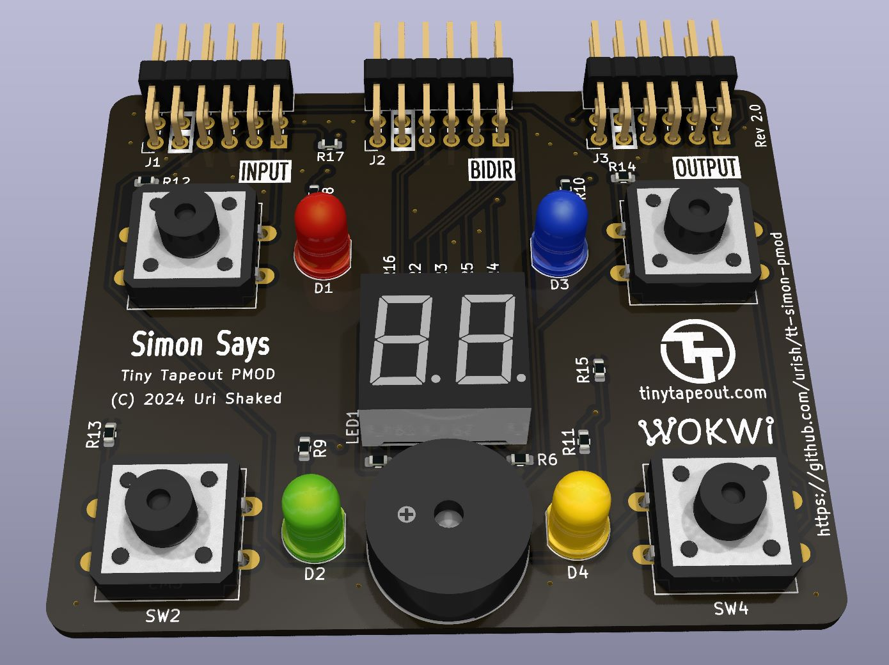

# Tiny Tapeout Simon Says PCB Pmod

A PCB for the Tiny Tapeout [Simon Says](https://github.com/urish/tt04-simon-game) project.

## Schematic (PDF)

- [Board revision 2](https://github.com/urish/tt-simon-pmod/releases/download/rev-2.0/simon-says-pmod.pdf)
- [Board revision 1](https://github.com/urish/tt-simon-pmod/releases/download/rev-1.0/simon-says-pmod.pdf)

## Hardware

- 4 LEDs (Red, Green, Blue, and Yellow)
- 4 Push buttons (Red, Green, Blue, and Yellow)
- 1 Piezo buzzer
- 2 Digit seven segment display
- 3 Pmod connectors
